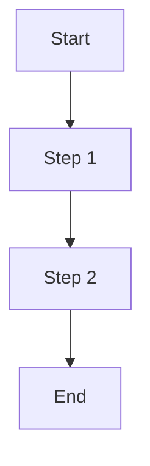

# User Flow: {{name}}

## Diagram

## Steps

### 1. {{step-name}}
- **Actor**: {{actor}}
- **Action**: {{action}}
- **Expected**: {{expected}}

## Alternative Paths

### Error: {{error-condition}}
- **Trigger**: {{trigger}}
- **Recovery**: {{recovery}}
